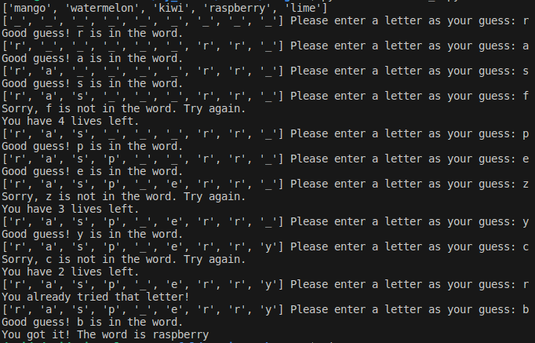

# Hangman
Hangman is a classic game in which a player thinks of a word and the other player tries to guess that word within a certain amount of attempts.

This is an implementation of the Hangman game, where the computer thinks of a word and the user tries to guess it.
# Milestone 2 
### Defining the list of possible words and assigning them to a variable called word_list, printing the output to the screen
This consisted of manually inputting a list of fruit and assigning the list to a variable called 'words'.
After that it was simply a matter of calling the print function and passing 'words' as an argument

### Choosing a random word from the list
This consisted of importing the 'random' module and using the 'random.choice' method to select a random element from the list 'words'
After that, I assigned random.choice to a variable 'word' and called it inside the print argument in order to print the randomly selected word

### Asking the user for input
This was a matter of writing a single line of code that equated the user input function to the variable 'guess'

### Checking that the input is a single character and alphabetical
In order to do this, I included a nested if-else statement. The outer if-else statement used the len() and alpha() methods to test whether the user input was both one character long and alphabetical.
The inner if-else statement checked whether the user input was in the randomly generated word

# Milestone 3

### Iteratively checking if the input is a valid guess
To achieve this, I created a while loop and set the default condition to True, then I set the 'guess' variable as an input.
Then, all I needed to do was create an 'if' statement to check whether the user input was both one character long and alphabetical, and add a break clause to trigger when the condition is met.
If the condition wasn't met, the else statement would print "Invalid letter. Please, enter a single alphabetical character."

### Checking whether the guess is in the word
This was a matter of writing an if-else statement that checks whether the user input is present in the variable 'word'

### Creating the functions to run the checks
In order to tidy the code I had written, I created a check_guess function which took one parameter, 'guess', and a function 'ask_for_input'.
The 'check_guess' function took the user input, converted it to lower case and checked whether or not it was in the variable 'word'. 
The 'ask_for_input' function contained the preceding while loop followed buy the 'check_guess' function with 'guess' passed as the argument.

# Milestone 4
## Creating the class
With a list of five fruits defined as 'word_list', the 'random' module imported and the variable 'word' passed as an argument to the 'choice' method from the 'random module':
I created a class 'Hangman' and within the 'init' magic method block, defined the attributes 'word', 'word_guessed', 'num_letters', 'num_lives', 'word_list' and 'list_of_guesses'. The parameters passed to the magic method were 'self', 'word_list' and 'num_lives'. I used the 'equals' operator to set the 'num_lives' parameter default to 5.
Within the 'init' magic method, I set the 'self' attributes to their counterparts, making sure to define 'word_guessed' as a list of individual underscores, 'num_letters' to the quantity of unique letters in the word, and 'list_of_guesses' to an empty list.

## Creating methods for running the checks
Next, I needed to define the methods within the class. As the game Hangman is played by guessing letters and displaying them in their corresponding positions in the word, I needed to accomplish the following:
* Take user input
* Validate user input
* Check if the user input is a repeat guess
* Check if the input(guess) exists in in the string 'word'
* Inform the user if the letter was in the word or not
* If the letter was in the word, express the position(s) in the list 'word_guessed' by replacing the underscores with the corresponding letter
* If the letter was not in the word, inform the user and reduce the number of lives by 1
* Inform the user how many lives they have left

I had, of course written a more rudimentary form of this code in milestone 3, so this was simply a matter of copying it into the methods 'ask_for_input' and 'check_guess'. 
The 'ask_for_input' method was almost functional, but still needed code to check if the input was a repeat guess, this consisted of a change to the 'if-else' statement, an 'elif' line that checks 'list_of_guesses' for the user input and informs the user if they have already used that letter.

However, where the code for 'check_guess' had previously only checked for the presence of the letter in 'word', this time it required a more complex format, since I would be returning a correct answer to _every_ relevant position in 'word_guessed'.
To accomplish this, I used a 'for' loop to iterate through 'word' and used an 'if' statement to check whether the index position of the iterator was equal to 'self.guess', and when this was true, assign the value of 'self.guess' to the iterator index of 'self.word_guessed'.

# Milestone 5
Once the Hangman class was defined, I only had to write a basic function to call it in a loop until either the variable 'num_lives' reached 0, or if the variable 'num_letters' reached 0 and continuously ask for input if not.
The parameter to the function is the list of words to be randomly selected from.

I also added some functionality to the 'ask_for_input' to display the positions of the already guessed letters.

Everything works as expected!

